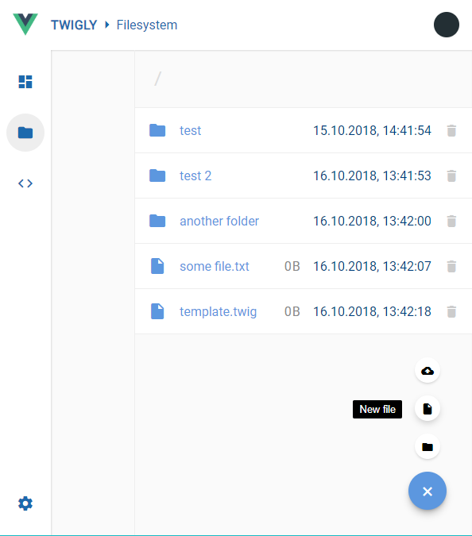

# Twigly
> Real-time twig template editor

## Build Setup

``` bash
# install dependencies
npm install

# serve with hot reload at localhost:8080
npm run dev

# build for production with minification
npm run build

# build for production and view the bundle analyzer report
npm run build --report
```

For a detailed explanation on how things work, check out the [guide](http://vuejs-templates.github.io/webpack/) and [docs for vue-loader](http://vuejs.github.io/vue-loader).

## Components
Twigly ships with a few core components that are detailed in the sections below.

### Code editor
  
To edit templates, aka. code, we'll need an editor. Twigly provides an integrated one, working on the [virtual filesystem](#filesystem). It allows (or will, soon) for most of the stuff you expect from a template editor - syntax highlighting, automatic or manual saving, suggestions while typing and keyboard shortcuts.  
Currently, the editor is active work in progress, but you *can* create files, edit them, and save them to the virtual disk.

### Settings
Twigly provides a few knobs for you to twiggle with (GOT IT??). All of them are accessible via the settings page, bottom left icon.  
Now, when you're working with a server-less app (as in, everything is running locally in the browser), doing something as trivial storing settings becomes a little harder, conceptually. So, partly to make things easy, but mostly because I can, the settings are stored in a JSON file - within the virtual filesystem. Oh yes. That is _so_ meta.  
Seriously though, the settings live inside `/settings.json`, and you can view and edit them right from Twigly's editor.

### Filesystem
  
Template languages, such as twig, invariably revolve around template files. To embrace this concept, Twigly provides a virtual file system, running on localStorage internally - which means all changes are persisted across page reloads.  
The file system itself is pretty basic, but allows for indefinitely nested directory structures, meta data and automatic caching. Around the core implementation, a couple of abstraction classes ease working and provide a familiar API.

In fact, the whole filesystem infrastructure has been created to allow for swapping out the persistence backend, so in the future, implementing a `DropboxFileSystem` or a `RestApiFileSystem` will be quite possible. For now, the only actual implementation will be `LocalStorageFileSystem`.

Basically, a file system must inherit from [`src/modules/FileSystem`](./src/modules/FileSystem.js) and implement its methods. No matter whether the file system works synchronously or asynchronously, all methods MUST return promises as to stay implementation independent. _How_ these methods actually work is completely up to the file system, as long as the public API stays compatible.

#### Filesystem API
All file systems expose the following API:

##### `readFile(String path): Promise<String>`
Reads the content of a file at the given path and returns it. While reading, the [`atime` metadata property](#atime) will be set to the current timestamp.

##### `writeFile(String path, String content = '', Number flags = 0): Promise<void>`
Writes the content of a file at the given path. Unless the `FileSystem.FILE_APPEND` flag has been passed, the content will be overridden, if it exists. While writing, the [`mtime` metadata property](#mtime) will be set to the current timestamp for both new and existing files. The [`ctime` metadata property](#ctime) will only be set for new files.

##### `appendFile(String path, String content = ''): Promise<void>`
Appends to the content of a file at the given path. This is a shorthand for calling `writeFile` with the `FileSystem.FILE_APPEND` flag. While writing, the [`mtime` metadata property](#mtime) will be set to the current timestamp for both new and existing files. The [`ctime` metadata property](#ctime) will only be set for new files.

##### `deleteFile(String path): Promise<void>`
Deletes the file at the given path.

##### `exists(String path): Promise<Boolean>`
Checks whether a file or directory with the given path exists on the file system and returns a boolean. This does not affect access time.

##### `createDirectory(String path, Boolean recursive = false): Promise<void>`
Creates a directory at the given path. If the recursive parameter has been set to true, all missing segments of the path will be created, if possible. `createDirectory` will fail if the given directory exists. While writing, the [`ctime` metadata property](#ctime) will be set to the current timestamp.

##### `readDirectory(String path): Promise<Array<String>>`
Reads the index of the directory and returns an array of paths of all files within the directory. While reading, the [`atime` metadata property](#atime) will be set to the current timestamp.

##### `deleteDirectory(String path): Promise<void>`
Deletes the directory at the given path.

##### `getType(String path): Promise<Number>`
Retrieves the file system item type of the item at the given path. Currently, there are two types implemented: `FileSystem.TYPE_FILE` (0) and `FileSystem.TYPE_DIRECTORY` (1). Note, however, that in the future, additional types - such as links - might be added.

##### `isDirectory(String path): Promise<Boolean>`
Checks whether the item at the given path is a directory. This will fail if the path does not exist.

##### `isFile(String path): Promise<Boolean>`
Checks whether the item at the given path is a file. This will fail if the path does not exist.

##### `getMetaData(String path): Promise<Object>`
Retrieves the full metadata object for the given path. This will fail if the path does not exist. For all available metadata fields, see the [Metadata section](#metadata).

##### `get(String path): Promise<FileSystemFile|FileSystemDirectory|FileSystemItem>`
Retrieves a `FileSystemItem` instance for the given path. This can be either a `FileSystemFile` or a `FileSystemDirectory`, each of which provide additional convenience methods to work with the requested item.  
These objects can be created for virtual (eg., non-existing) files but have to be connected to a `FileSystem` instance by using the `filesystem` setter on the file for any actual file system operations to be carried out.

##### `getUsedSpace(): Promise<Number>`
Retrieves the amount of bytes currently occupied on the file system.

##### `getTotalSpace(): Promise<Number>`
Retrieves the total amount of bytes available on the file system, the "disk" size, if you will.

##### `getAvailable(): Promise<Number>`
Retrieves the amount of available, non-occupied bytes on the file system. A default implementation is included that will simply substract the used bytes from the total bytes, relying on the respective methods.

#### Metadata
Twigly provides a basic set of metadata for both files and directories. The following fields are available and will be automatically set:

##### `ctime`
Numeric timestamp an item has been created on the filesystem.

##### `mtime`
Numeric timestamp an item has been modified on the filesystem. This includes changes to file content and certain metadata fields.

##### `atime`
Numeric timestamp an item has been accessed on the filesystem. This includes most read operations of file content or metadata.

##### `size`
Numeric size of a file in characters (bytes, basically - let's not get started on multi-byte unicode characters :smile:). Directories will always report `0` until a recursive size calculation algorithm has been implemented (send me a PR!).

##### `type`
Type of the file system item.

#### FileSystemItem API
FileSystemItem objects provide a convenience layer on top of the file system. They represent a single entity and allow its modification. The base class provides methods that apply to all items, while the specialized classes add their own methods. 

##### `getName(): String`
Retrieves the basename of an item. The transparent `name` getter can be used for the same effect.

##### `getPath(): String`
Retrieves the full path of an item. The transparent `path` getter can be used for the same effect.

##### `getMeta(): Promise<Object>`
Retrieves the full metadata for an item. The transparent `meta` getter can be used for the same effect.

##### `isDirectory(): Promise<Boolean>`
Checks whether an item is a directory.

##### `isFile(): Promise<Boolean>`
Checks whether an item is a file.

##### `delete(): Promise<void>`
Deletes an item from the file system.

##### `get/set fileSystem`
Allows to get and set the file system instance used to interact with the file system. This is required for all methods that access data within the filesystem (content, metadata).
